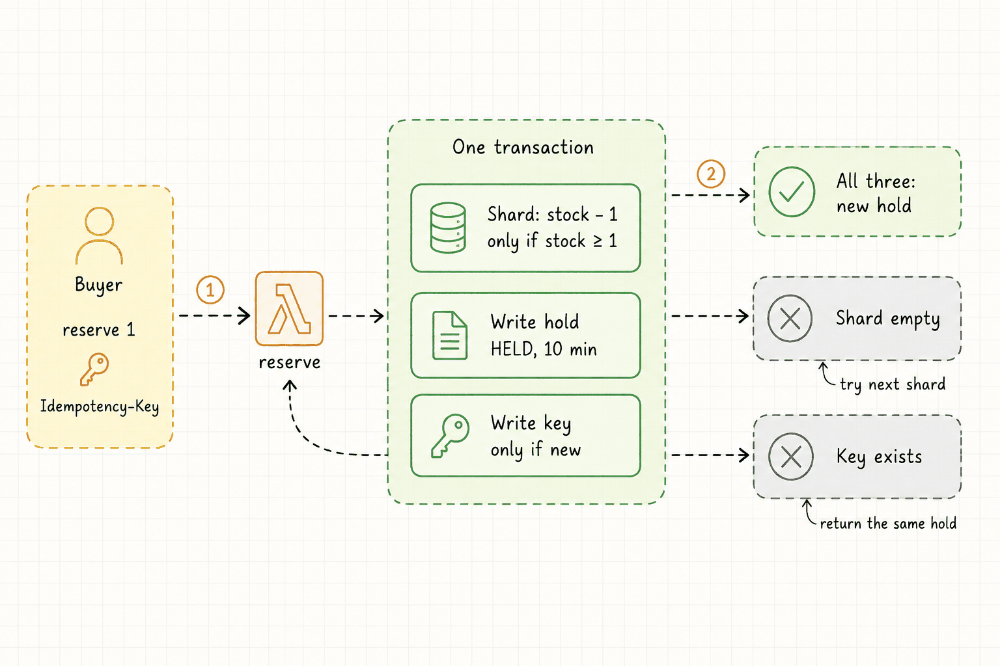
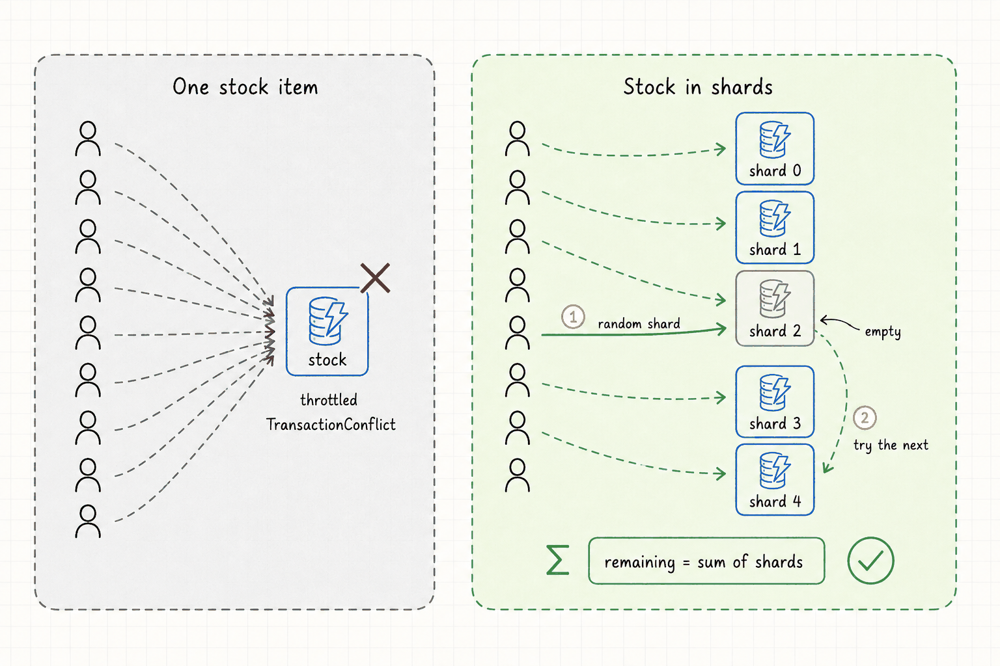
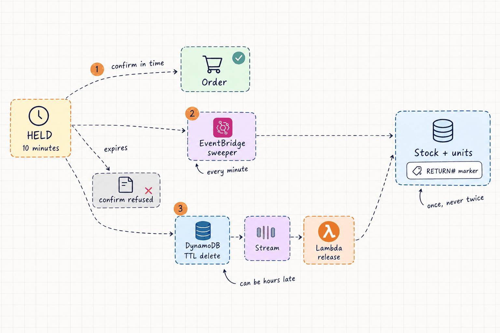

# Flash-Sale Reservations

A personal AWS lab: a reservation service for a fixed stock of units (tickets,
a limited drop) sold to far more buyers than there are units, all in the same
few seconds. It runs on API Gateway, Lambda and one DynamoDB table, and is
built around five problems that only show up at that scale: overselling, a hot
DynamoDB item, late TTL deletes, retries and double clicks, and failing
politely under a burst. Everything is Terraform, applied from CI over GitHub
OIDC with no static AWS credentials.

There are no real users. Every scale claim will come from a k6 run in this
repo that anyone can rerun. Until a test has run, it says "Not run".

**Project page:** https://talhaimtiaz09.github.io/flash-sale-reservations/


## Status

| Part | State |
|---|---|
| Lambdas: `reserve`, `confirm`, `get_sale`, `release`, `sweeper` + `shared` | Written; 36 unit tests pass (pytest + moto); ruff clean |
| Terraform: `bootstrap`, `table`, `functions`, `api`, `alarms`, `envs/lab` | Written; passes fmt, validate, tflint and trivy |
| CI: `terraform.yml` (plan on PR, approved apply), `lambdas.yml` (ruff, pytest) | Written; passes actionlint |
| `scripts/seed_sale.py`, five k6 tests, runbooks | Written |
| Deployed to AWS | Not yet. Nothing has been applied |
| Load tests | Not run. Results are published as measured, including misses |

## API

| Route | What it does |
|---|---|
| `POST /sales/{sale_id}/reserve` | Body `{"qty": n}`, header `Idempotency-Key`. Holds n units for 10 minutes. 201 new hold, 200 same key again, 409 sold out, 429 busy or throttled, 400 bad input |
| `POST /holds/{hold_id}/confirm` | Turns a live hold into an order. 200, or 409 if expired or already confirmed |
| `GET /sales/{sale_id}` | Remaining stock (the sum of the shards) and status |

Sales are created by `scripts/seed_sale.py`, not through the API.

## How it works

A reservation is one DynamoDB transaction with three writes: take units from a
stock shard only if it has enough, write the hold, and write the idempotency key
only if it is new. They succeed or fail together.



One stock item puts every buyer on one partition, which throttles and
conflicts. The stock is split across shard items instead; each buyer starts at
a random shard and moves on if it is empty.



A hold either becomes an order in time or its units go back to stock, through
the sweeper or the stream consumer after a TTL delete. Both write a `RETURN#`
marker in the same transaction, so units come back once.



## Layout

```
lambdas/
  reserve/ confirm/ get_sale/   one transaction per reserve; expiry checked at confirm
  release/                      stream consumer: returns stock on TTL deletes of HELD holds
  sweeper/                      schedule: deletes expired holds, returns stock
  shared/                       keys, typed values, the idempotent stock-return transaction
  tests/                        pytest against moto
terraform/
  bootstrap/      state bucket, plan / apply roles (reuses the account's GitHub OIDC provider), budget
  modules/table   on-demand with a cap, stream, TTL, PITR, sparse live-holds index
  modules/functions  one role per function, stream mapping + DLQ, sweeper schedule
  modules/api     HTTP API, stage throttling, access logs
  modules/alarms  SNS email, alarms, dashboard
  envs/lab        wires the modules
scripts/seed_sale.py
loadtest/         k6: oversell, hot-key, ttl-return, idempotency, burst
runbooks/         one per test, filled in only from real runs
docs/index.html   the project page (GitHub Pages); diagrams in docs/images/
prompts/          ChatGPT prompts for those diagrams
.github/workflows/  terraform.yml, lambdas.yml
```

Setup and CI details: [`terraform/README.md`](terraform/README.md). Load tests:
[`runbooks/`](runbooks/).

## Why reserved concurrency is off by default

Reserved concurrency on `reserve` would cap how many copies run at once, so a
burst can't take every unit of the account's Lambda concurrency. It is still a
variable that defaults to `null`, for two reasons:

- New AWS accounts can start with a Lambda concurrency quota as low as 10,
  not the usual 1,000.
- Lambda refuses any reservation that would leave fewer than 100 unreserved
  executions in the account.

On a 10-quota account, any number in `reserve_reserved_concurrency` fails the
apply, and the account can't run a meaningful burst test either. So the
default leaves it unset, and the API stage throttle (`api_throttle_rate_limit`,
`api_throttle_burst_limit`) does the limiting. Check the quota with
`aws lambda get-account-settings`, ask for an increase if it is 10, and only
then set a reservation. Keep the stage limits below what that reservation can
serve, so clients get API Gateway's 429 rather than a Lambda throttle.

## Cost

Near $0 idle: no always-on compute, and the table is on-demand. While
`envs/lab` is up, the standing charges are its 14 CloudWatch alarms and the
dashboard, pro-rated by the hour. Load tests are billed per request and the
table's on-demand cap bounds a runaway run. Each runbook records what its run
actually cost. `envs/lab` is destroyed between sessions; `bootstrap` stays up
(about $1 a month for the state bucket's KMS key).
